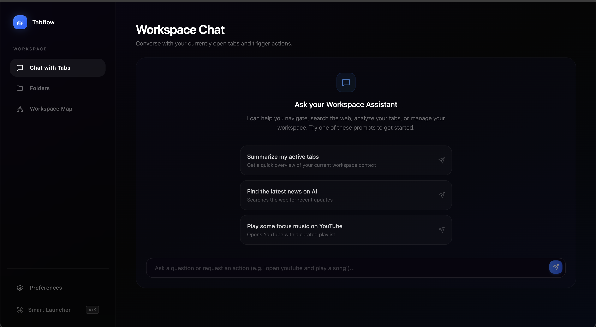
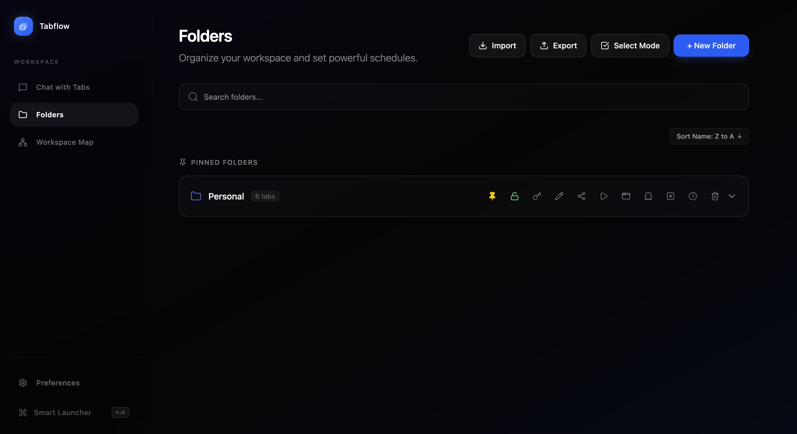

# Tabflow: AI-Powered Browser Workspace

Tabflow is a next-generation browser extension designed to supercharge your productivity. It uses advanced AI to act as your personal assistant, organizing your tabs into dedicated workspaces, securing your private content with AES-256 encryption, and scheduling your workflow automatically.

  

## 📸 Screenshots

- **Workspace Chat:** 
  
- **Folders Manager:**
  
- **Workspace Map:**
  

## ✨ Key Features

- **🤖 AI Assistant Integration:** Talk to your built-in AI assistant directly from the dashboard. Ask it to organize tabs, close specific sites (e.g., "close all YouTube tabs"), or summarize content. The AI understands natural language and controls the browser for you!
- **🔑 Bring Your Own Key (BYOK):** Simply plug in your own API key to get started! It's incredibly easy to use, and you can even connect it to OpenRouter to use powerful AI models completely for free.
- **📁 Smart Workspaces:** Group your open tabs into distinct, named folders (like "Work", "Entertainment", or "Research"). 
- **🗺️ Interactive Workspace Map:** Visualize all your folders in a dynamic, draggable node-based canvas. Turn on **Domain Similarity Links** to instantly connect and group tabs from the same website. You can also seamlessly drag and drop tabs from one folder node to another to reorganize them!
- **🔒 AES-256 Folder Encryption:** Need privacy? Lock specific folders with a custom password. Tabs inside locked folders are hidden and inaccessible until you unlock them. Includes a recovery phrase fallback system.
- **⏱️ Automated Tab & Folder Scheduling:** Schedule entire workspaces or individual tabs to open or close at specific dates and times automatically.
- **⚡ Quick-Access Popup:** Click the Tabflow extension icon in your browser toolbar to instantly save your current tab into any of your folders without opening the full dashboard.
- **🚀 Smart Launcher:** Hit `Cmd/Ctrl + K` to instantly open the launcher. You can type AI commands or use the search bar to access and manage all your saved workspaces.

## 🚀 Installation Guide

Since Tabflow is currently in developer preview, you can easily install it locally in any Chromium-based browser (Chrome, Edge, Brave, Opera, Vivaldi).

1. Clone this repository or download the ZIP file.
2. Unzip the downloaded file to a permanent folder on your computer.
3. Open your browser and go to your extensions page:
   - Chrome: `chrome://extensions/`
   - Edge: `edge://extensions/`
   - Brave: `brave://extensions/`
4. Turn on **"Developer mode"** (usually a toggle in the top right corner).
5. Click **"Load unpacked"** (or "Load unpacked extension").
6. Select the folder where you unzipped Tabflow.
7. **Important:** Click on "Details" for the Tabflow extension and turn on **"Allow in Incognito"** so you can manage your private browsing tabs too.
8. **You're done!** Pin the Tabflow icon to your toolbar for easy access.

## 🛠️ How to Use It

### The Dashboard
To open the main dashboard, simply click the Tabflow extension icon in your toolbar and click **"Open Dashboard"**. From here, you can drag and drop folders on the canvas, talk to the AI assistant on the right panel, and manage all your tabs.

### ⚡ Folder Quick Actions
When you hover over any workspace folder in your dashboard, you gain access to powerful 1-click trigger buttons:
- **▶️ Open / Close:** Instantly open all tabs in the folder, or close them all at once.
- **🕒 Schedule Trigger:** Set an exact date and time for the folder to automatically open, close, or expire.
- **🔗 Share:** Export and share your entire workspace setup with others.
- **🔒 Lock & Secure:** Password-protect the folder to completely hide its contents until unlocked.

### 🤖 AI Capabilities & Triggers
The built-in AI isn't just a chatbot—it has direct access to control your browser and organize your data. You can trigger the following actions simply by asking the AI in natural language (either in the dashboard chat or via the `Cmd/Ctrl + K` Launcher):

- **Tab Management**
  - **Open Tabs:** *"Open youtube.com"* (`OPEN_TAB`)
  - **Close Tabs:** *"Close all my tabs"*, *"Close all tabs with 'recipe' in the title"* (`CLOSE_TAB`)

- **Workspace Organization**
  - **Save Tabs:** *"Save my current tab to the Work folder"* (`ADD_TAB`)
  - **Delete Tabs/Folders:** *"Remove Netflix from my Inbox"*, *"Delete the Old Project folder"* (`DELETE_TAB`, `DELETE_FOLDER`)
  - **Move & Copy:** *"Move my Reddit tab from Work to Entertainment"* (`MOVE_TAB`, `COPY_TAB`)
  - **Rename:** *"Rename my 'Misc' folder to 'Read Later'"* (`RENAME_FOLDER`)
  - **Restore:** *"Open all the tabs in my Research folder"* (`RESTORE_FOLDER`)

- **Automation & Security**
  - **Scheduling:** *"Schedule my Work folder to open tomorrow at 9:00 AM"*, *"Close my Twitter tab in 15 minutes"* (`SCHEDULE_FOLDER`, `SCHEDULE_TAB`)
  - **Clear Schedules:** *"Cancel the schedule for my Work folder"* (`CLEAR_SCHEDULE`)
  - **Locking:** *"Lock my Private folder"* (`LOCK_FOLDER`)

*Note: Before the AI executes any of these commands, a **Confirm Actions** popup will appear so you can review exactly what the AI intends to do and either Approve or Reject it.*

### Locking a Workspace
To secure a workspace:
1. Hover over the folder in the dashboard sidebar.
2. Click the 🔒 Lock icon.
3. Set a password and a recovery word.
4. Once locked, the folder's contents will be completely hidden. To unlock it, click the lock icon again and enter your password.

## 🏗️ Technologies Used
- React 18
- TypeScript
- Vite
- Tailwind CSS
- Framer Motion (for smooth animations)
- Chrome Extensions API (Manifest V3)
- WebCrypto API (for secure AES-256 encryption)

---

## 🤝 Collaborate & Connect

Tabflow is an open-source project and we would absolutely love your help to make it even better! 

Whether you want to fix a bug, suggest a new feature, or completely redesign a component, **feel free to collaborate, open an issue, or submit a pull request!** 

If you just want to connect, chat about browser extensions, or share your thoughts, don't hesitate to reach out!
